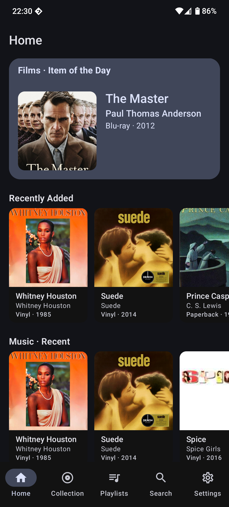
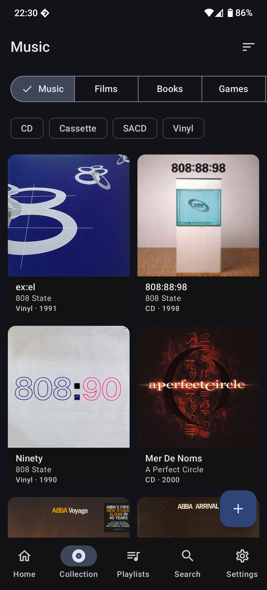
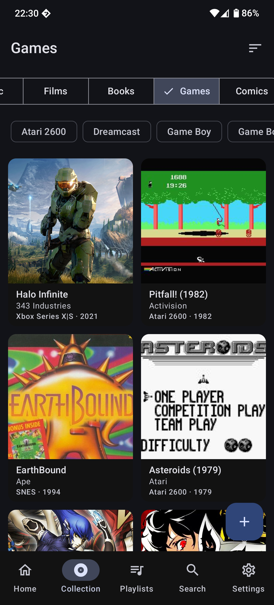
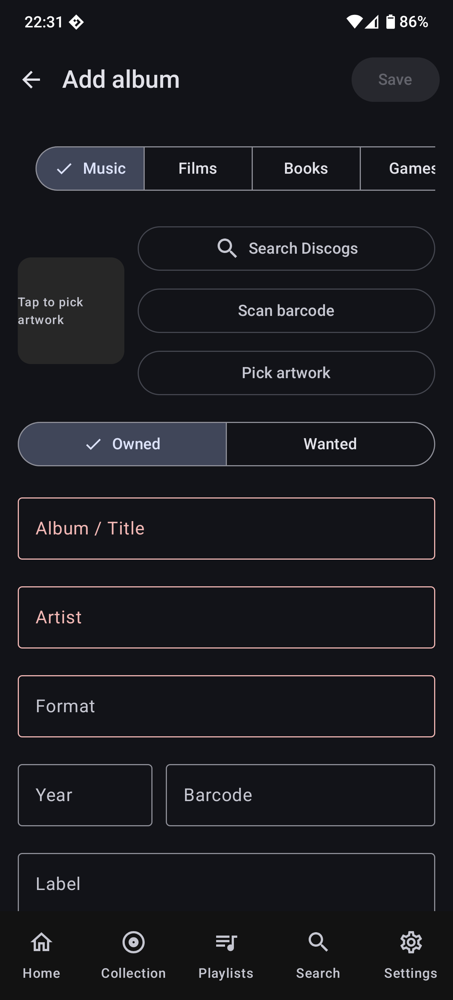
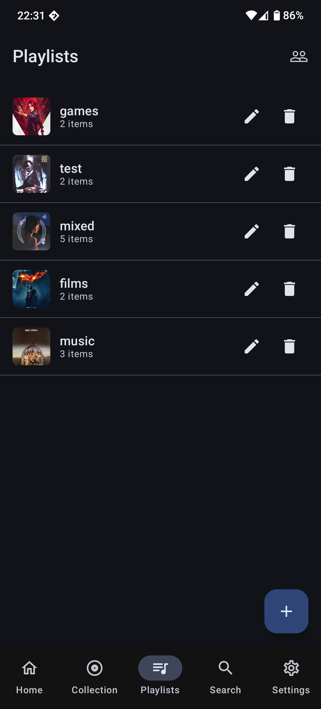
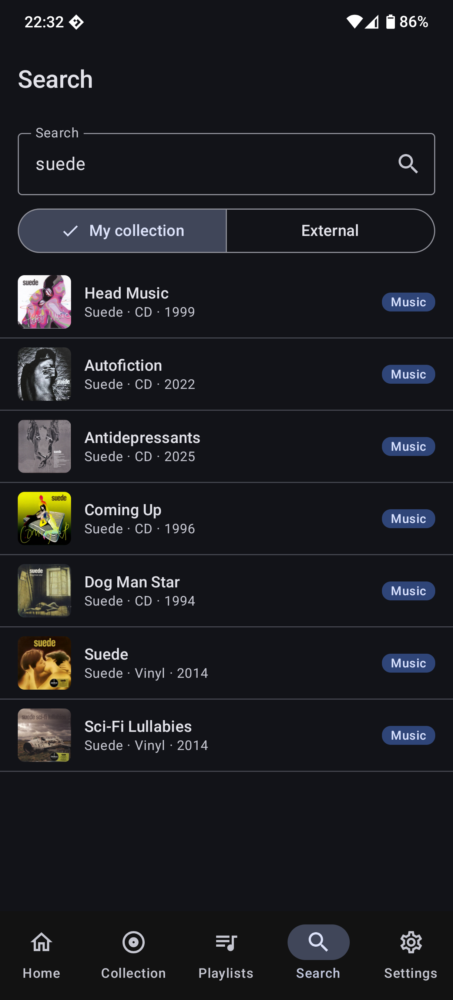

# Crate — Android

Native Android companion for [Crate](https://github.com/megamaced/crate), a personal physical media cataloguing app for Nextcloud.

> **100 % AI-written.** Every line of source, every test, every CI workflow, this README, and almost every commit message in this repository was written by [Claude Code](https://www.anthropic.com/claude-code) under direction from a human reviewer. No code in this repository was hand-typed.

## Screenshots

<p align="center">
  
  
  
</p>
<p align="center">
  
  
  
</p>

## Status

Functional — all core features are implemented and working. Releases are currently **debug builds only**, which means in-place upgrades are not supported; you must uninstall before installing a new version.

## Features

- **Home feed** — Item of the Day, Recently Added, and per-category recent items
- **Collection browsing** — browse by category (Music, Films, Books, Games, Comics) with format chip filters and sorting
- **Add & edit items** — full form with category-specific formats, year, barcode, label, and artwork
- **Barcode scanning** — scan barcodes with the camera (ZXing, no Google Play Services required)
- **Discogs search** — search Discogs to auto-fill album metadata when adding music
- **Artwork** — pick artwork from your device or pull it from external search results
- **Playlists** — create, edit, and delete playlists; add/remove items
- **Search** — search your own collection or external sources
- **Sharing** — share collections with other Nextcloud users; view collections shared with you
- **Offline support** — full offline cache with Room; background delta sync via WorkManager
- **Owned / Wanted** — track items you own vs. items on your wishlist
- **Material You** — dynamic colour theming on Android 12+ with dark mode support

## Requirements

- Android 10 (API 29) or newer
- A Nextcloud instance running the [Crate server app](https://github.com/megamaced/crate)

## Tech stack

- Kotlin 2.x + Jetpack Compose + Material 3 (with Material You dynamic colour on Android 12+)
- Hilt for dependency injection
- Retrofit 2 + OkHttp 5 + kotlinx.serialization
- Room 2.7 for offline cache
- Coil 3 for image loading
- ZXing for barcode scanning (F-Droid friendly — no Google Play Services)
- WorkManager for background delta sync

## Building

```
./gradlew assembleDebug
```

Debug APK is written to `app/build/outputs/apk/debug/`.

## Distribution

F-Droid + sideload. The build intentionally avoids any Google Play Services dependencies so it can be published through F-Droid and installed on de-Googled devices.

## License

[AGPL-3.0-or-later](LICENSE) — same as the Crate server app and Nextcloud itself.
