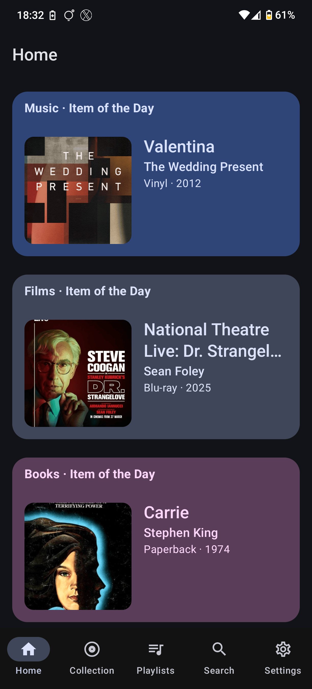
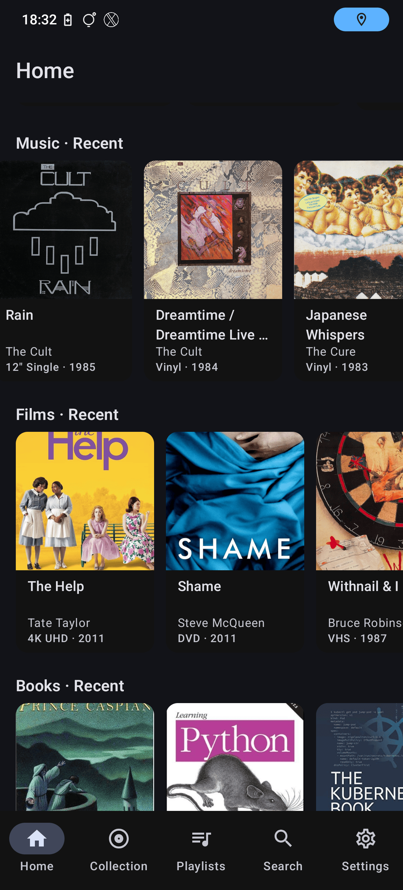
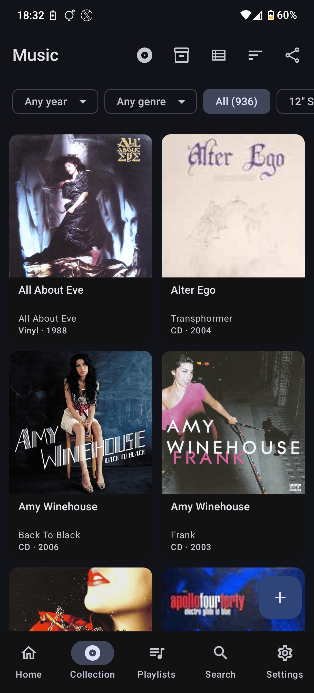
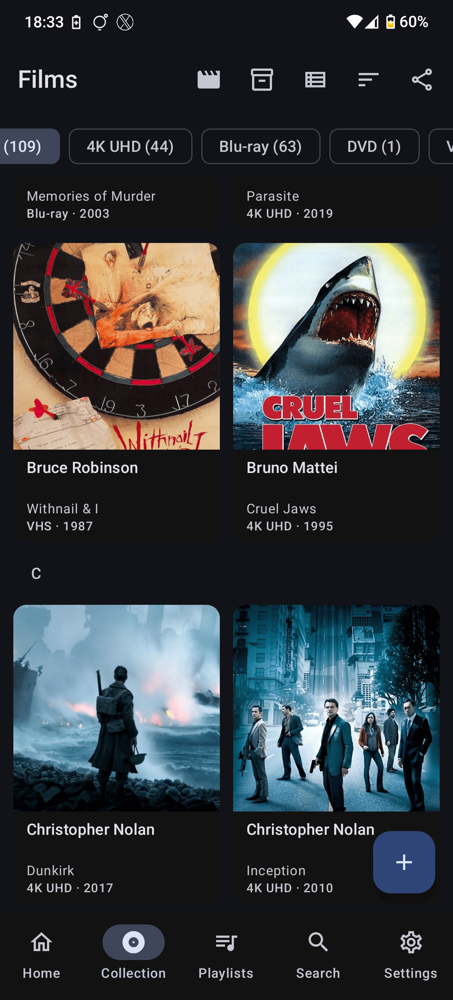
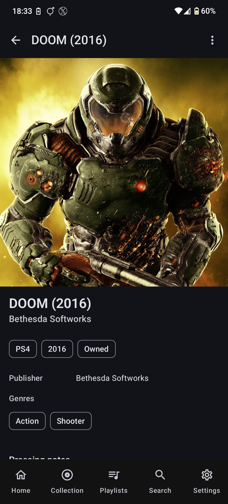
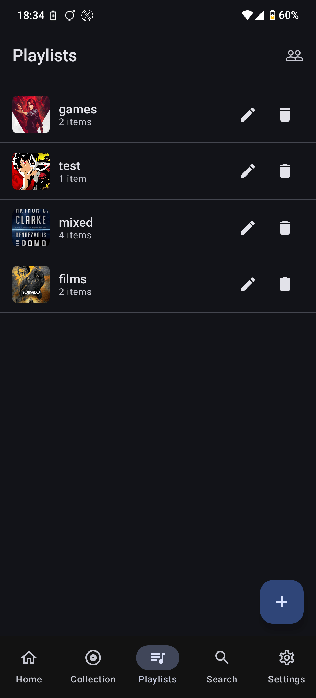
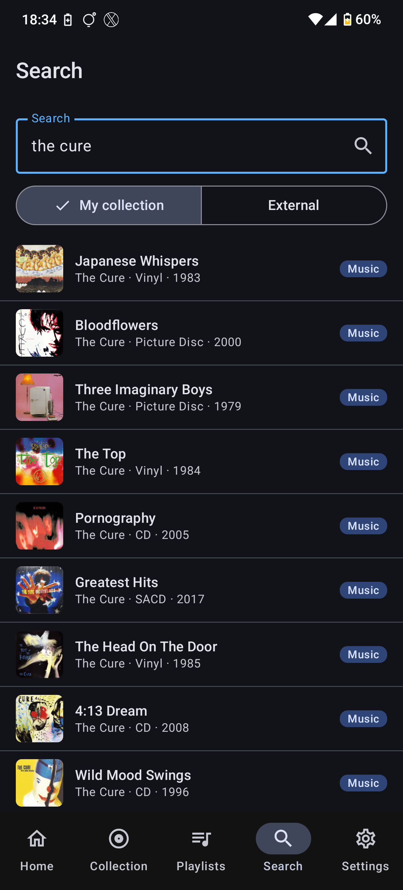
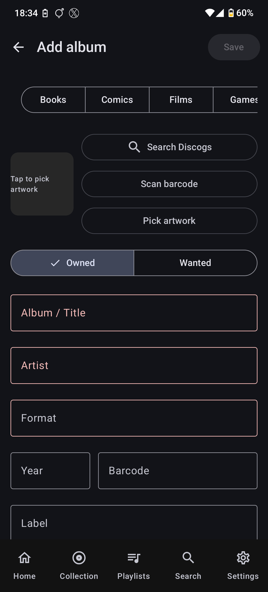

# Crate — Android

Native Android companion for [Crate](https://github.com/megamaced/crate), a personal physical media cataloguing app for Nextcloud.

> **100 % AI-written.** Every line of source, every test, every CI workflow, this README, and almost every commit message in this repository was written by [Claude Code](https://www.anthropic.com/claude-code) under direction from a human reviewer. No code in this repository was hand-typed.

## Screenshots

<p align="center">
  
  
  
  
</p>
<p align="center">
  
  
  
  
</p>

<!-- When bumping the app version, update the Status line below to match app/build.gradle.kts versionName. -->


## Status

Released. Signed APKs are published on the [Releases page](https://github.com/megamaced/crate-android/releases/latest), which always points at the current version.

There's a manual **Check for updates** button under *Settings → About* that polls GitHub for newer releases on demand and posts a notification linking to the release page if one is available. The app does *not* check for updates on launch — F-Droid policy forbids unsolicited third-party network calls at startup, and the app behaves the same way regardless of where you installed it from.

## Features

- **Home feed** — Item of the Day, Recently Added, Most Valuable, and per-category recent items
- **Collection browsing** — card *or* list view, with category tabs (Music, Films, Books, Games, Comics) and format-filter chips that surface per-format counts ("LP (12)", "CD (4)") and a total
- **Add & edit items** — full form with category-specific formats, year, barcode, label, original purchase price + currency, and artwork
- **Barcode scanning** — scan barcodes with the camera (ZXing, no Google Play Services)
- **External metadata search** — Discogs (music), TMDB (films), Open Library (books), RAWG (games), ComicVine (comics)
- **Artwork** — pick artwork from your device or pull it from external search results
- **User photo slots** — two extra photos per item alongside the artwork (receipts, sleevenotes, disc shots). EXIF/GPS metadata is stripped client-side before upload; an image this device cannot strip is refused rather than sent
- **Original price tracking** — record what you originally paid and see gain/loss against the current market value on each item
- **Playlists** — create, edit, and delete playlists; add/remove items
- **Search** — search your own collection or external sources
- **Sharing** — share collections with other Nextcloud users; view collections shared with you
- **Offline support** — full offline cache with Room; background delta sync via WorkManager
- **Owned / Wanted** — track items you own vs. items on your wishlist
- **Nextcloud-blue Material 3** — themed in Nextcloud's brand colours so the app sits visually alongside the official Nextcloud client suite

## Requirements

- Android 10 (API 29) or newer
- A Nextcloud instance running the [Crate server app](https://github.com/megamaced/crate)

## Installation

### F-Droid (recommended)

[](https://f-droid.org/packages/com.megamaced.crate/)

The app is published on F-Droid as `com.megamaced.crate`. This is the route most people want: the F-Droid client notices new releases and updates the app for you. Install the [F-Droid client](https://f-droid.org), search for **Crate**, and install from there.

The listing is a **reproducible build**. F-Droid rebuilds the app from this repository at the release tag, verifies the result matches the APK signed with the developer's key, and distributes that same signed APK. Both channels therefore carry the same signature, so you can move between the F-Droid build and a GitHub-release APK in either direction **without uninstalling**.

### APK from GitHub Releases

Download the latest signed `app-release.apk` from the [Releases page](https://github.com/megamaced/crate-android/releases/latest) and install it. You will need to allow "install from unknown sources" for your browser the first time.

Subsequent updates install in place over the existing app. Use *Settings → About → Check for updates* when you want to see if a newer version is published.

## Tech stack

- Kotlin 2.x + Jetpack Compose + Material 3 (Nextcloud-blue palette)
- Hilt for dependency injection
- Retrofit 2 + OkHttp 5 + kotlinx.serialization
- Room for offline cache, with versioned migrations + instrumented `MigrationTestHelper` coverage
- Coil 3 for image loading
- ZXing for barcode scanning (F-Droid friendly — no Google Play Services dependency)
- WorkManager for background delta sync
- DataStore Preferences for app-side settings

## Building

```
./gradlew assembleDebug
```

Debug APK is written to `app/build/outputs/apk/debug/`.

For signed release builds, see [docs/SIGNING.md](docs/SIGNING.md). The F-Droid recipe mirror lives at [docs/fdroid/com.megamaced.crate.yml](docs/fdroid/com.megamaced.crate.yml).

## License

[AGPL-3.0-or-later](LICENSE) — same as the Crate server app and Nextcloud itself.
